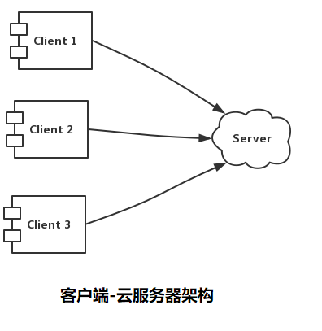
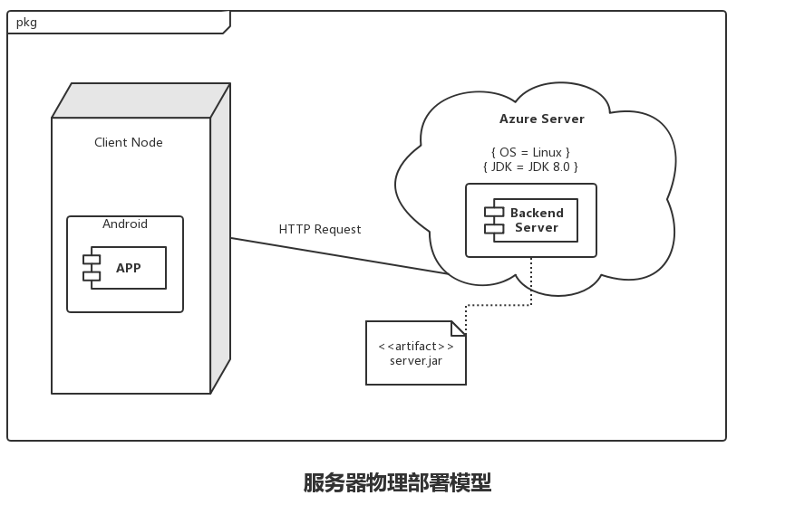
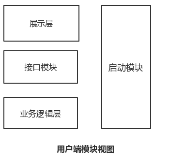

# 软件体系结构文档

## 文档修改历史

| 修改人员 | 日期       | 修改原因 | 版本号      |
| :------: | ---------- | -------- | ----------- |
|  庄子元  | 2019.11.22 | 最初草稿 | V1.0.0 草稿 |

## 目录

- [软件体系结构文档模板](#软件体系结构文档模板)
  - [文档修改历史](#文档修改历史)
  - [目录](#目录)
  - [1. 引言](#1-引言)
    - [1.1 编制目的](#1.1-编制目的)
    - [1.2 词汇表](#1.2-词汇表)
    - [1.3 参考资料](#1.3-参考资料)
  - [2. 产品概述](#2-产品概述)
  - [3. 逻辑视图](#3-逻辑视图)
  - [4. 组合视图](#4-组合视图)
    - [4.1 开发包图](#4.1-开发包图)
    - [4.2 运行时进程](#4.2-运行时进程)
    - [4.3 物理部署](#4.3-物理部署)
  - [5. 架构设计](#5-架构设计)
    - [5.1 模块职责](#5.1-模块职责)
    - [5.2 展示层分解](#5.2-展示层分解)
      - [5.2.1 展示层模块的职责](#5.2.1-展示层模块的职责)
      - [5.2.2 展示层模块的接口规范](#5.2.2-展示层模块的接口规范)
    - [5.3 业务逻辑层分解](#5.3-业务逻辑层分解)
      - [5.3.1 职责](#5.3.1-职责)
      - [5.3.2 接口规范](#5.3.2-接口规范)
    - [5.4 数据层分解](#5.4-数据层分解)
      - [5.4.1 数据层模块的职责](#5.4.1-数据层模块的职责)
      - [5.4.2 接口规范](#5.4.2-接口规范)
  - [6. 信息视角](#6-信息视角)
    - [6.1 数据持久化对象](#6.1-数据持久化对象)
    - [6.2 数据库表](#6.2-数据库表)

## 1. 引言

### 1.1 编制目的

本报告详细的完成了租呗闲置物品租赁系统的概要设计，达到了指导详细设计和开发的目的，同时实现开发者与测试人员及用户之间的沟通。

本报告面向开发人员、测试人员及最终用户编写，是了解及使用系统的导航。

### 1.2 词汇表

| 词汇名称 |       词汇含义       | 备注                                        |
| :------: | :------------------: | ------------------------------------------- |
|   租呗   | 租呗闲置物品租赁系统 | @Data注解表示为该类添加构造器和Set、Get方法 |

### 1.2 参考资料

软件工程与计算(卷2) - 软件开发的技术基础

## 2. 产品概述

租呗闲置物品租赁系统是3Rookies小组参加2019年华东赛区Hackathon大赛的Demo产品，旨在给学生校内租赁、借用物品带来便利。

通过租呗app的上线，可以为学生减少在校园公共平台、QQ群、微信群等寻物、租物、售物的麻烦，提高学生闲置物品的使用率，达到便利同学、减少浪费的作用。

## 3. 逻辑视图

租呗闲置物品管理系统中，选用了MVC体系风格的结构。由于安卓程序开发的特殊性，以及选用的开发技术(Spring Boot框架)在配置上的简化，使得在进行逻辑设计时，只需要将系统抽象为3层：模型层(Model)、展示层(View)和控制层(Controller)，即可示意整个高层抽象。

模型层负责数据的持久化和访问；展示层包含基于Android系统应用程序界面UI的的实现和用户行为的响应；控制层包含业务逻辑处理的实现。

体系结构的逻辑视角和逻辑设计方案如下图所示：

## 4. 组合视图

### 4.1 开发包图

|      开发包       |                                  依赖的其他开发包                                  |
| :---------------: | :--------------------------------------------------------------------------------: |
|    CorsConfig     |                spring-boot-starter-jdbc spring-boot-starter-web                 |
|   SwaggerConfig   |                  spring-boot-starter-jdbc junit-vintage-engine                  |
|  SimpleResponse   | spring-boot-starter-jdbc spring-boot-starter-web mybatis-spring-boot-starter |
|  FileController   |                                mysql-connector-java                                |
|  ItemController   |                                       lombok                                       |
| MyFormController  |                                 springfox-swagger2                                 |
| SessionController |                                                                                    | springfox-swagger2 |
|  TestController   |                              spring-boot-starter-test                              |
|  UserController   |                                                                                    |
|    ItemEntity     |                                                                                    |
|   MyFormEntity    |                                                                                    |
|    Order_state    |                                                                                    |
|    UserEntity     |                                                                                    |
|     AuthForm      |                                                                                    |
|     ItemForm      |                                                                                    |
|    MyOrderForm    |                                                                                    |
|     UserForm      |                                                                                    |

### 4.2 运行时进程

租呗闲置物品租赁管理系统中，会有多个客户端进程和一个服务器端进程。结合部署图，客户端进程在客户端机器上运行，服务器端进程在服务器端机器上运行。进程图如图所示。

### 4.3 物理部署

在租呗闲置物品租赁系统中，客户端构建是放在客户端机器上的，服务器端构件是放在Azure云服务器上的。在客户端节点上，只要在Android 5.0 及以上的安卓操作系统即可。具体部署图如图所示。

## 5. 架构设计

### 5.1 模块职责

由于Android应用程序开发的特殊性，租呗闲置物品租赁系统的用户端通过 HTTP Request 链接后端服务器。

用户端的模块视图如下图所示：

用户端各层的职责如下表所示：

|    层    | 职责                                             |
| :------: | ------------------------------------------------ |
| 启动模块 | 负责启动系统，初始化网络通信机制和数据服务的连接 |
|  展示层  | 租呗应用程序的客户端用户界面                     |
| 接口模块 | 负责客户端和服务器端的通信及数据传递             |

每一层只是使用下方直接接触的层。层与层之间仅仅是通过接口的调用来完成的。层之间调用的接口如下表所示。

| 接口 | 服务调用方     | 服务提供方       |
| :--- | :------------- | :--------------- |
| api  | 客户端接口模块 | 客户端业务逻辑层 |

服务器端模块视图如下图所示：

服务器端各层的职责如下表所示：

|     层     | 职责                                             |
| :--------: | ------------------------------------------------ |
|  启动模块  | 负责启动系统，初始化网络通信机制和数据服务的连接 |
|   展示层   | 基于Web的影院管理系统的客户端用户界面            |
|  接口模块  | 负责客户端和服务器端的通信及数据传递             |
| 业务逻辑层 | 对用户界面的输入进行响应并执行业务处理逻辑       |
| 数据服务层 | 抽象出的数据操作接口                             |
|   数据层   | 负责数据的持久化和访问                           |

每一层只是使用下方直接接触的层。层与层之间仅仅是通过接口的调用来完成的。层之间调用的接口如下表所示。

| 接口 | 服务调用方         | 服务提供方         |
| :--- | :----------------- | :----------------- |
| API  | 服务器端展示层     | 服务器端接口模块   |
| api  | 服务器端接口模块   | 服务器端业务逻辑层 |
| api  | 服务器端业务逻辑层 | 服务器端数据服务层 |
| api  | 服务器端数据服务层 | 服务器端数据层     |

### 5.2 展示层分解

// TODO

#### 5.2.1 展示层模块的职责

#### 5.2.2 展示层模块的接口规范

### 5.3 业务逻辑层分解

业务逻辑层包含多个针对界面的业务逻辑处理对象。

#### 5.3.1 业务逻辑层模块的职责

业务逻辑层的职责如下表所示：

| 模块              | 职责                                                     |
| ----------------- | -------------------------------------------------------- |
| MyFormController  | 下订单 查看订单                                       |
| SessionController | 用户登录 用户退出登录                                 |
| ItemController    | 出租物品 搜索物品 查看物品详情 返回物品列表  |
| UserController    | 用户注册 修改密码 修改个人信息                     |

#### 5.3.2 业务逻辑层模块的接口规范

| 提供的服务                  | 语法接口                                                                                                    |
| :-------------------------- | :---------------------------------------------------------------------------------------------------------- |
| ItemController.register     | public SimpleResponse register(@ApiIgnore HttpSession session, @RequestBody ItemForm itemForm)              |
| ItemController.returnAll    | public SimpleResponse returnAll(@ApiIgnore HttpSession session)                                             |
| ItemController.check        | public SimpleResponse check(@ApiIgnore HttpSession session, @PathVariable("url") String url)                |
| ItemController.find         | public SimpleResponse find(@ApiIgnore HttpSession session, @PathVariable("description") String description) |
| ItemController.modifyItem   | public SimpleResponse modifyItem(@ApiIgnore HttpSession session, @RequestBody ItemForm itemForm)            |
| UserController.registerUser | public SimpleResponse registerUser(@ApiIgnore HttpSession session, @RequestBody UserForm userForm)          |
| SessionController.login     | public SimpleResponse login(@ApiIgnore HttpSession session, @RequestBody AuthForm authForm)                 |
| MyFormController.register   | public SimpleResponse register(@ApiIgnore HttpSession session, @RequestBody MyOrderForm myOrderForm)        |
| MyFormController.checkForm  | public SimpleResponse checkForm(@ApiIgnore HttpSession session, @PathVariable("seller") String seller)      |

### 5.4 数据层分解

数据层主要给业务逻辑层提供数据访问服务，包括对于持久化数据的增、删、改、查。模块设计和各个模块所提供的服务分别如图所示。

#### 5.4.1 数据层模块的职责

数据层模块的职责如下表所示：

| 模块        | 职责                                                                                              |
| ----------- | ------------------------------------------------------------------------------------------------- |
| ItemMapper  | 根据url选择物品，选择所有物品，根据出售者选择物品，根据购买者选择物品，插入物品，有选择的更新物品 |
| OrderMapper | 根据url选择订单，根据id选择订单                                                                   |
| UserMapper  | 根据用户名选择用户，根据id选择用户，添加用户                                                      |

#### 5.4.2 数据层模块的接口规范

| 提供的服务                   | 语法接口                                       |
| ---------------------------- | ---------------------------------------------- |
| ItemMapper.Sel_by_url        | ItemEntity Sel_by_url(String url)              |
| ItemMapper.Sel_all           | List\<ItemEntity> Sel_all()                    |
| ItemMapper.Sel_by_seller     | List\<ItemEntity> Sel_by_seller(String seller) |
| ItemMapper.Sel_by_buyer      | List\<ItemEntity> Sel_by_buyer(String buyer)   |
| ItemMapper.insert            | int insert(ItemEntity itemEntity)              |
| ItemMapper.update_selective  | int update_selective(ItemEntity itemEntity)    |
| OrderMapper.insert           | int insert(MyFormEntity myFormEntity)          |
| OrderMapper.Sel_by_url       | MyFormEntity Sel_by_url(String url)            |
| OrderMapper.Sel_by_id        | MyFormEntity Sel_by_id(Integer id)             |
| OrderMapper.update           | int update(MyFormEntity myFormEntity)          |
| UserMapper.Sel_by_username   | UserEntity Sel_by_username(String username)    |
| UserMapper.Sel_by_PrimaryKey | UserEntity Sel_by_PrimaryKey(Integer id)       |
| UserMapper.insert            | int insert(UserEntity user)                    |

### 6. 信息视角

#### 6.1 数据持久化对象

在此对系统的实体类做简单的介绍：

- Item 租赁物品
  - add_time
  - buyer
  - category
  - delivery
  - description
  - id
  - longest_time
  - price
  - seller
  - url

- MyForm 订单
  - create_time
  - id
  - state
  - total_price
  - url

- User 用户
  - balance
  - department
  - description
  - id
  - password
  - realname
  - sex
  - url
  - username

#### 6.2 数据库表

数据库中包含：

- Auth 表
- Item 表
- MyOrder 表
- User 表
