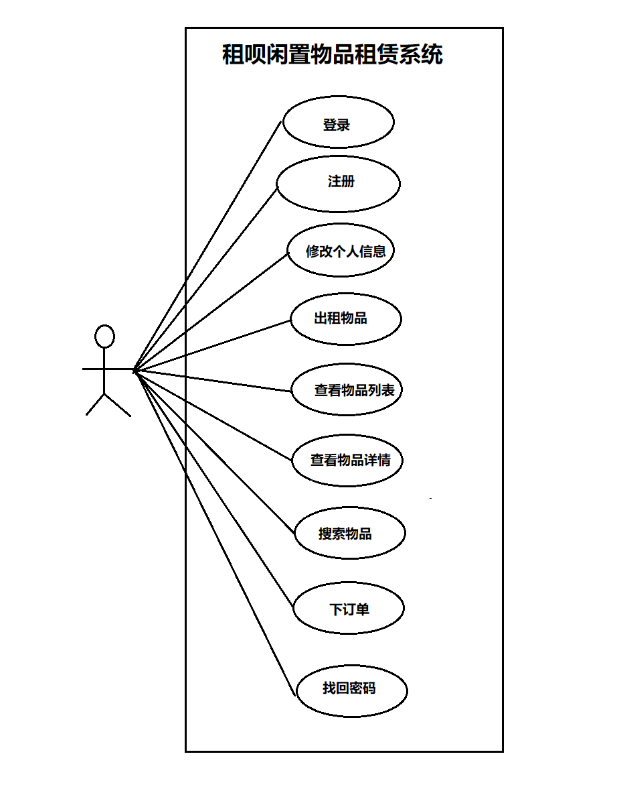

# 租呗闲置物品租赁系统用例文档

## 更新历史

| 修改人员 |    日期    | 变更原因 |   版本号   |
| :------: | :--------: | :------: | :--------: |
|  庄子元  | 2019.11.22 | 最初草稿 | v1.0.0草稿 |

## 目录

- [租呗闲置物品租赁系统用例文档](#租呗闲置物品租赁系统用例文档)
  - [更新历史](#更新历史)
  - [1. 引言](#1-引言)
    - [1.1 目的](1.1-目的)
    - [1.2 阅读说明](#1.2-阅读说明)
    - [1.3 参考文献](#1.3-参考文献)
  - [2. 用例图](#2-用例图)
  - [3. 用例列表](#3-用例列表)
  - [4. 详细用例描述](#4-详细用例描述)
    - [4.1 登录](#4.1-登录)
    - [4.2 注册](#4.2-注册)
    - [4.3 修改个人信息](#4.3-修改个人信息)
    - [4.4 出租物品](#4.4-出租物品)
    - [4.5 查看物品列表](#4.5-查看物品列表)
    - [4.6 查看物品详情](#4.6-查看物品详情)
    - [4.7 搜索物品](#4.7-搜索物品)
    - [4.8 下订单](#4.8-下订单)
    - [4.9 找回密码](#4.9-找回密码)
  - [5. 需求分析模型](#5-需求分析模型)
    - [5.1 系统顺序图](#5.1-系统顺序图)
      - [5.1.1 登录](#5.1.1-登录)
      - [5.1.2 注册](#5.1.2-注册)
      - [5.1.3 修改个人信息](#5.1.3-修改个人信息)
      - [5.1.4 出租物品](#5.1.4-出租物品)
      - [5.1.5 查看物品列表](#5.1.5-查看物品列表)
      - [5.1.6 查看物品详情](#5.1.6-查看物品详情)
      - [5.1.7 搜索物品](#5.1.7-搜索物品)
      - [5.1.8 下订单](#5.1.8-下订单)
      - [5.1.9 找回密码](#5.1.9-找回密码)
    - [5.2 概念类图](#5.2-概念类图)
      - [5.2.1 登录](#5.2.1-登录)
      - [5.2.2 注册](#5.2.2-注册)
      - [5.2.3 修改个人信息](#5.2.3-修改个人信息)
      - [5.2.4 出租物品](#5.2.4-出租物品)
      - [5.2.5 查看物品列表](#5.2.5-查看物品列表)
      - [5.2.6 查看物品详情](#5.2.6-查看物品详情)
      - [5.2.7 搜索物品](#5.2.7-搜索物品)
      - [5.2.8 下订单](#5.2.8-下订单)
      - [5.2.9 找回密码](#5.2.9-找回密码)

## 1. 引言

### 1.1 目的

本文档描述了租呗闲置物品租赁系统的用户需求，包括观众、管理员、程序维护人员，旨在通过本文档更好的明确当前阶段需求，推动开发工作的进一步进行。

### 1.2 阅读说明

文档内用例的描述使用了《软件工程与计算（卷二）软件开发的技术基础》附表一的模板，结合《软件工程与计算·二》课程内容撰写完成。

文档内说明约束如下：

- 系统：指的是此租呗闲置物品租赁系统
- 用户：指本网站的使用者，分为已登录（下或称”已被识别或授权“）的用户和未登录亟待注册的访客两种。用例说明在涉及到用户且对这两种用户未作区分的情况下，主要指以登录拥有账号的用户。
- 管理员：指由系统所有方指派或雇佣的对系统后台有部分或全部操作权限的人员，激活管理员权限需要登录对应的管理员账户（下或称”已被识别或授权“）
- 《软件工程与计算（卷二） 软件开发的技术基础》中已经定义的名称（如用例、顺序图、状态图）在本文档中完全沿用其定义
- 未被上述词条定义的词汇均符合《现代汉语词典（第六版）》的定义

### 1.3 参考文献

软件工程与计算（卷二） 软件开发的技术基础》

## 2. 用例图

## 3. 用例列表

| 参与者 |           用例           |
| :----: | :---------------------- |
|  用户  | 1. 登录  2. 注册   3. 修改个人信息  4. 出租物品  5. 查看物品列表   6. 查看物品详情   7. 搜索物品   8. 下订单   9.找回密码 |

## 4. 详细用例描述

### 4.1 登录

- 用例编号： UC1
- 名称： 登录
- 创建者： 庄子元
- 创建日期： 2019.11.22
- 最后一次更新者： 庄子元
- 更新日期： 2019.11.22
- 参与者： 用户
- 触发条件：用户登录租呗软件
- 前置条件：无
- 后置条件：进入主界面
- 优先级：高
- 正常流程：
  1. 用户/管理员输入用户名和密码；
  2. - 如果登录者是普通用户，则系统跳转至用户首页界面；
     - 如果登录者是管理员，则系统跳转至管理员首页界面。
- 扩展流程：
- 1a. 用户输入的用户名不存在
  - 系统提示用户名不存在，并返回正常流程1
- 1b. 用户输入用户名存在但密码错误
  - 系统提示密码错误，并返回正常流程1。
- 特殊需求：无

### 4.2 注册

- 用例编号： UC2
- 名称： 注册
- 创建者： 庄子元
- 创建日期： 2019.11.22
- 最后一次更新者： 庄子元
- 更新日期： 2019.11.22
- 参与者： 用户
- 触发条件：用户注册租呗软件账号
- 前置条件：无
- 后置条件：进入登录界面
- 优先级：中
- 正常流程：
  - 用户输入用户名、密码、以及第二次输入密码；
  - 用户输入学号，并上传校园卡照片实名认证；
  - 系统保存用户信息并提示注册成功。
- 扩展流程：
  - 1a. 用户输入的用户名或密码为空：
    - 系统提示用户输入为空，并返回正常流程1。
  - 1b. 用户输入的用户名已存在:
    - 系统提示用户名已存在，并返回正常流程1。
  - 1c. 用户输入的两次密码不一致:
    - 系统提示用户输入的密码不一致，并返回正常流程1.
- 特殊需求：

### 4.3 修改个人信息

- 用例编号： UC3
- 名称： 修改个人信息
- 创建者： 庄子元
- 创建日期： 2019.11.22
- 最后一次更新者： 庄子元
- 更新日期： 2019.11.22
- 参与者： 用户
- 触发条件：通用户通过修改个人信息来管理个人信息页面
- 前置条件：用户已登录账号
- 后置条件：进入个人中心
- 优先级：中
- 正常流程：
  - 用户选择要修改修改信息类别，包括性别，头像，个人描述（可选），姓名，院系；
  - 用户输入信息
  - 系统保存修改后的信息并提示修改成功。
- 扩展流程：
  - 用户输入的信息与原信息相同：
    - 系统提示用户输入的信息与原来的信息相同，并返回正常流程2。
- 特殊需求：无

### 4.4 出租物品

- 用例编号： UC4
- 名称： 出租物品
- 创建者： 庄子元
- 创建日期： 2019.11.22
- 最后一次更新者： 庄子元
- 更新日期： 2019.11.22
- 参与者： 用户
- 触发条件：用户上架一个出租的物品
- 前置条件：用户已被识别和授权
- 后置条件：进入上架商品的商品详细信息页面
- 优先级：高
- 正常流程：
  - 出租用户输入出租物品的详情，包括：物品类别、名称、文字介绍、实物图片、本人可接受的最大出租时长，租金；
  - 系统保存物品详情，提示上架成功；
  - 上架成功后，如用户欲取消出租，可随时撤回出租申请
- 扩展流程：
  - 1a. 用户输入信息存在空值：
    - 系统提示用户输入存在空值，并返回正常流程1。
  - 1b. 用户输入的名称信息存在重复：
    - 系统提示用户输入名称重复，并返回正常流程1。
  - 1c. 用户输入的可接受的最大出租时长小于8h
    - 系统提示出租时间不能过短，并返回正常流程1。
- 特殊需求：
  - 出租的物品信息应和出租方信息一并上架，让其他用户一键查看物品提供者的个人信息。

### 4.5 查看物品列表

- 用例编号： UC1
- 名称： 登录
- 创建者： 庄子元
- 创建日期： 2019.11.22
- 最后一次更新者： 庄子元
- 更新日期： 2019.11.22
- 参与者： 用户
- 触发条件：用户需要浏览所有商品界面
- 前置条件：无
- 后置条件：进入商品展示界面
- 优先级：高
- 正常流程：
  - 用户选择要查看的物品类别；
  - 系统显示物品列表，包括名称、实物图片、出租方、租金等简单信息。
- 扩展流程：无
- 特殊需求：无

### 4.6 查看物品详情

- 用例编号： UC6
- 名称： 查看物品详情
- 创建者： 庄子元
- 创建日期： 2019.11.22
- 最后一次更新者： 庄子元
- 更新日期： 2019.11.22
- 参与者： 用户
- 触发条件：用户想要查看所选商品的详细信息
- 前置条件：无
- 后置条件：进入商品详情页
- 优先级：高
- 正常流程：
  - 用户选择一件物品查看详情；
  - 系统显示物品的详细资料，包括名称、实物图片、出租方、租金、可租借最长时间。
- 扩展流程：无
- 特殊需求：无

### 4.7 搜索物品

- 用例编号： UC7
- 名称： 搜索物品
- 创建者： 庄子元
- 创建日期： 2019.11.22
- 最后一次更新者： 庄子元
- 更新日期： 2019.11.22
- 参与者： 用户
- 触发条件：用户需要根据一定条件来搜索并查看物品信息
- 前置条件：无
- 后置条件：进入商品展示界面
- 优先级：高
- 正常流程：
  - 用户输入关键字；
  - 系统显示名称和类别以及介绍中含有关键字的物品列表，每项包括名称、实物图片、出租方、租金等信息。
- 扩展流程：
  - 若无搜索结果，则提示暂无结果
  - 用户输入为空，则不进行搜索
- 特殊需求：无

### 4.8 下订单

- 用例编号： UC8
- 名称： 登录
- 创建者： 庄子元
- 创建日期： 2019.11.22
- 最后一次更新者： 庄子元
- 更新日期： 2019.11.22
- 参与者： 用户
- 触发条件：用户租用所选商品
- 前置条件：用户已被识别和授权
- 后置条件：无
- 优先级：高
- 正常流程：
  - 用户输入想要的物品类别和个人要求，说明租借时长以及提供的租金
  - 系统保存信息并提示下单成功等待接单；
  - 下单成功后，用户可以撤回订单。
- 扩展流程：用户输入为空，系统提示输入为空，并返回正常流程1。
- 特殊需求：无

### 4.9 找回密码

- 用例编号： UC9
- 名称： 找回密码
- 创建者： 庄子元
- 创建日期： 2019.11.22
- 最后一次更新者： 庄子元
- 更新日期： 2019.11.22
- 参与者： 用户
- 触发条件：用户想要找回密码
- 前置条件：无
- 后置条件：进入个人详情页
- 优先级：中
- 正常流程：
  - 用户请求找回密码；
  - 用户输入学号，获取验证码；
  - 验证成功后，提示用户输入新的密码；
  - 用户重复输入密码；
  - 系统提示密码修改成功，返回登录界面。
- 扩展流程：
  - 用户输入学号格式不正确：
    - 请用户重新输入，返回正常流程2。
  - 用户输入验证码不正确：
    - 请用户重新验证，返回正常流程2。
- 特殊需求：无

## 5. 需求分析模型

TODO

### 5.1 系统顺序图

TODO

#### 5.1.1 登录

#### 5.1.2 注册

#### 5.1.3 修改个人信息

#### 5.1.4 出租物品

#### 5.1.5 查看物品列表

#### 5.1.6 查看物品详情

#### 5.1.7 搜索物品

#### 5.1.8 下订单

#### 5.1.9 找回密码

### 5.2 整体概念类图

TODO

#### 5.2.1 登录

#### 5.2.2 注册

#### 5.2.3 修改个人信息

#### 5.2.4 出租物品

#### 5.2.5 查看物品列表

#### 5.2.6 查看物品详情

#### 5.2.7 搜索物品

#### 5.2.8 下订单

#### 5.2.9 找回密码
