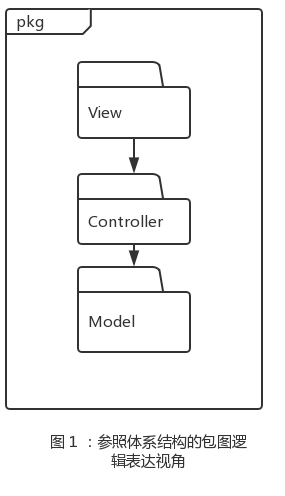
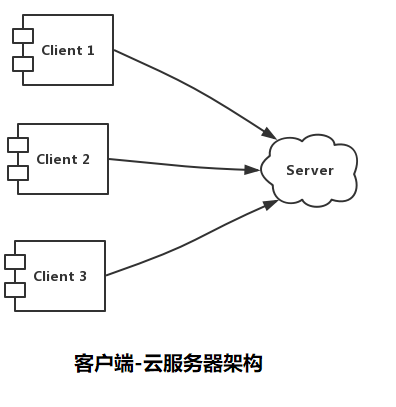
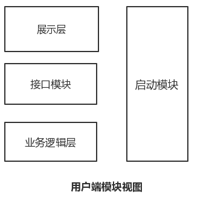
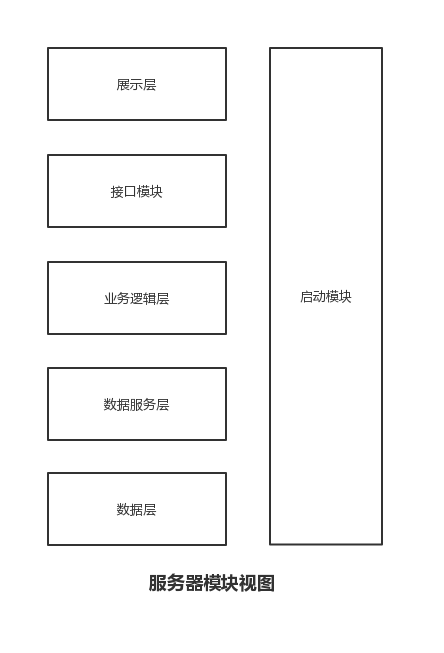
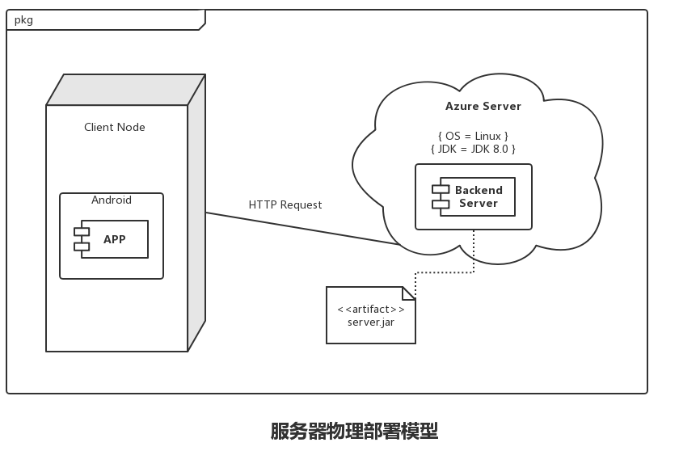

# 租呗项目计划书

## 校园闲置物品租赁系统 3Rookies小组

## 目录

* [租呗项目计划书](#租呗项目计划书)
  * [项目介绍](#项目介绍)
  * [团队介绍](#团队介绍)
  * [产品叙述](#产品叙述)
    * [需求满足](#需求满足)
      * [功能性需求](#功能性需求)
        * [用户管理](#用户管理)
        * [状态管理](#状态管理)
        * [商品管理](#商品管理)
        * [订单管理](#订单管理)
      * [非功能性需求](#非功能性需求)
        * [安全性](#安全性)
        * [可维护性](#可维护性)
        * [易用性](#易用性)
        * [可靠性](#可靠性)
    * [体系结构](#体系结构)
      * [逻辑视图](#逻辑视图)
      * [运行时进程](#运行时进程)
      * [物理部署](#物理部署)
  * [项目创新](#项目创新)
    * [传统校园租赁](#传统校园租赁)
    * [租呗校园租赁系统](#租呗校园租赁系统)
  * [目标对象及分析](#目标对象及分析)
    * [目标对象及市场](#目标对象及市场)
    * [对象分析](#对象分析)
    * [市场分析](#市场分析)
  * [项目推广及前景](#项目推广及前景)
    * [发展计划](#发展计划)
    * [所需条件](#所需条件)
    * [项目竞争力](#项目竞争力)
  * [工程文档](#工程文档)

## 项目介绍

租呗闲置物品租赁是3Rookies团队在微软华东五校Hackathon比赛所开发，基于安卓系统实现校园内物品租赁的Demo产品。开发目的是为了帮助校内同学更加方便的实现闲置物品的租赁和借用，包括登录、注册、修改个人信息、出租物品、查看物品列表、查看物品详情、搜索物品、下订单、找回密码等服务。

通过闲置物品管理系统-租呗的上线，可以帮助学生减少寻租、租物的困难，提升闲置物品的使用率，提高生活体验，降低生活成本，并且生活更加绿色环保。

## 团队介绍

3Rookies团队由来自南京大学软件学院的3名大二学生组成。

组长：程荣鑫；组员：李淳，庄子元。

* 程荣鑫负责项目前端开发和工作调度；
* 李淳负责项目后端搭建和逻辑层实现；
* 庄子元负责项目文档的撰写、维护以及资料信息的搜集工作。

## 产品叙述

高校大学生租赁服务是租赁业的一个分支, 也就是高校大学生通过校内租赁平台进行的租赁活动。

高校大学生租赁与社会上的租赁有所不同, 其运行机制是校内租赁平台将学生各种待出租资源(如教科书、复习资料、课外书、服装、舞台道具、交通用具、运动器材及其他物品等)整合后展示给所有的学生。在这种租赁活动中，学生充当的角色有，出租方：拥有闲置物品；承租方：从学生手里租取物品。

### 需求满足

#### 功能性需求

##### 用户管理

* **注册** 无账号用户可以通过其姓名、学号、性别、校园卡照片、类型(学生 / 老师)、用户名来往系统中添加用户表单，获得登录系统凭证
* **修改个人信息** 用户可以在个人主页面上修改个人描述、所在专业、用户名等个人信息
* **修改密码** 用户可以通过个人教育邮箱的验证码进行验证，确认本人身份后可以修改密码。旧密码不能与新密码相同。

##### 状态管理

* **登录** 用户可以根据其用户名和密码获取后端授权和认证，从而使用该软件的服务。本软件的大多数服务都需要登录后才能使用
* **退出登录** 用户在点击退出登录后可以退出登录状态

##### 商品管理

* **出租物品** 物品上架后实例化表单，自增的生成其唯一的{id}，将物品上架，等待租赁。
* **搜索物品** 根据物品描述中的关键字、物品的{url}或是物品的{id}来查找物品，然后显示被查找的物品。
* **查看物品详情** 根据物品的{url}查找物品，返回物品的实例后显示物品详情。
* **返回物品列表** 获取所有物品的列表，显示给发起请求的用户。

##### 订单管理

* **下订单** 用户发起租赁请求，如果操作成功，则物品显示被租赁，并给出租者和租赁者都新增一个订单。
* **查看订单** 根据订单的id或是订单的url来选择订单并展示。

#### 非功能性需求

##### 安全性

* Safety1: 系统中，用户的用户名、密码、学号、校园卡照片等都以密文形式存储在Azure服务器端，由Azure云服务器平台保证其安全可靠。
* Safety2: 用户端的部分功能需要经过系统验证与授权才能使用
* Safety3: 只有通过学生邮箱认证才能修改密码，学生邮箱功能由腾讯企业邮箱保证其安全可靠。

##### 可维护性

* Maintainability1: 用户上架待租商品时，可以在 0.01 个人月内完成。
* Maintainability2: 本项目需要有注释和软件开发文档说明。

##### 易用性

* Usability1: 所有类型的人员都不需要专门的培训，都可以在 10 分钟内掌握并完成一个操作。
* Usability2: 本项目将对不同型号、不同屏幕大小的安卓智能手机和版本号大于 Android 5.0 的安卓操作系统进行适配。

##### 可靠性

* Reliability1: 网络畅通，客户端与服务器通信时，不会发生故障。
* Reliability2: 多个用户请求发生冲突时，将根据冲突处理策略逐个进行处理。

### 体系结构

#### 逻辑视图

租呗闲置物品管理系统中，选用了MVC体系风格的结构。由于安卓程序开发的特殊性，以及选用的开发技术(Spring Boot框架)在配置上的简化，使得在进行逻辑设计时，只需要将系统抽象为3层：模型层(Model)、展示层(View)和控制层(Controller)，即可示意整个高层抽象。

模型层负责数据的持久化和访问；展示层包含基于Android系统应用程序界面UI的的实现和用户行为的响应；控制层包含业务逻辑处理的实现。

体系结构的逻辑视角和逻辑设计方案如下图所示：

#### 运行时进程

租呗闲置物品租赁管理系统中，会有多个客户端进程和一个服务器端进程。结合部署图，客户端进程在客户端机器上运行，服务器端进程在服务器端机器上运行。进程图如图所示。

#### 物理部署

在租呗闲置物品租赁系统中，客户端构建是放在客户端机器上的，服务器端构件是放在Azure云服务器上的。在客户端节点上，只要在Android 5.0 及以上的安卓操作系统即可。具体部署图如图所示。

#### 架构设计

用户端的模块视图如下图所示：

用户端各层的职责如下表所示：

|    层    | 职责                                             |
| :------: | ------------------------------------------------ |
| 启动模块 | 负责启动系统，初始化网络通信机制和数据服务的连接 |
|  展示层  | 租呗应用程序的客户端用户界面                     |
| 接口模块 | 负责客户端和服务器端的通信及数据传递             |

服务器端模块视图如下图所示：

服务器端各层的职责如下表所示：

|     层     | 职责                                             |
| :--------: | ------------------------------------------------ |
|  启动模块  | 负责启动系统，初始化网络通信机制和数据服务的连接 |
|   展示层   | 基于Web的影院管理系统的客户端用户界面            |
|  接口模块  | 负责客户端和服务器端的通信及数据传递             |
| 业务逻辑层 | 对用户界面的输入进行响应并执行业务处理逻辑       |
| 数据服务层 | 抽象出的数据操作接口                             |
|   数据层   | 负责数据的持久化和访问                           |

## 项目创新

|          | 传统校园租赁           | 租呗软件                     |
| -------- | ---------------------- | ---------------------------- |
| 交易模式 | 中介依赖大             | 交易扁平化                   |
| 便利度   | 步骤繁琐，资源整合度低 | 信息发布快捷，检索简单       |
| 经营模式 | 盈利型企业             | 纯公益非盈利项目             |
| 基础投入 | 场地、人力资源         | 云服务器租用                 |
| 用户保障 | 无                     | 利用校园卡和教育邮箱验证身份 |

### 传统校园租赁

* 交易分层严重，中介依赖大
  * 目前存在的校园租赁平台，更多的是校园出租中介的形式，通过购买或是租用学生、社会上的闲置资源，再转租给学生，从中收取差价的形式。
* 交易步骤繁琐，资源整合度低
  * 学生之间寻租或出租需要通过QQ群、QQ空间等发布信息，通过转发来扩散信息
* 交易收取中介费，增加学生开销
  * 租赁中介大多是盈利型公司或企业，通过转租、出租来收取差价，从中盈利
* 基建和人力投入较大
  * 传统校园租赁中介需要一个固定的储物场所和一定人力进行管理，基础投入巨大；如果是学生之间自行交易则需要较多的时间投入才能完成一个交易。
* 用户保障差
  * 传统校园租赁只能通过QQ好友验证问题或是QQ群加群验证问题来判断用户身份，难以保障用户的纯净性，给租赁和后续追偿带来风险。

### 租呗校园租赁系统

* 交易扁平化，去除繁琐中间步骤
  * 租呗校园租赁系统是一个完全的用户-用户的交易模式，学生直接与学生对接，没有任何中介或是中间环节。
* 信息发布快捷，检索简单
  * 用户只需要将待租或寻租订单发布到平台，即可通过简单快捷的检索找到所需物品。
* 纯公益，无花费
  * 租呗校园租赁系统是基于Azure云服务的一个平台，后期版本迭代后可以委托学工处或是学生会进行运维管理，便利学生。
* 仅需云服务器租金
  * 租呗校园租赁系统扁平化的架构可以方便学生之间自行交易，无需物品存储和人力资源管理。仅需要简单的服务器维护和租用Azure云服务。
* 用户保障好
  * 租呗校园租赁系统利用校园卡和教育邮箱验证身份，保证一人一账号，每次租用追溯历史、追偿便捷快速，保证用户权益和后续风险把控。

除以上相比于传统校园租赁的优势外，租呗还有得天独厚的独有优势。租呗的项目托管在Azure云端，由Microsoft公司保障数据安全。同时具有很好的维护性和迁移性，便于后续发展和迭代开发。

## 目标定位及分析

闲置物品租赁平台租呗是为了满足高校学生校园租赁业务发展需求而开发的。面对大量的需求和较高的访问量，利用租呗平台，可以更好的服务学生、校工，提高南大学生的生活质量，降低物品闲置率。

### 目标对象及市场

租呗闲置物品租赁平台的目标对象是高校在校师生；目标市场是全国各地各大高校。

### 对象分析

在校园中，尤其是高校，学生的购买欲较强。然而学生的收入来源有限，校外的租赁费用较高，因此学生对校内租赁有较大需求。

高校学生在校期间居住生活时间一般为3-4年, 其学习、生活用品除长期使用的必须品外, 很多使用率低的物品没有购买的必要, 比如旱冰鞋、教材等。在高校, 由于学生的收入较低, 租赁成为了很多有短期的需求的学生的首选。
  
### 市场分析

#### 租赁平台短缺

高校租赁这种新兴的消费模式, 目前并没有广泛的流行起来，存在的原因主要是缺乏便捷快速的校园租赁平台。

通过对南京大学校内的调研, 我们了解到有相当一部分学生还是有租赁 (承租或出租) 意愿和需求的, 只是缺乏校园租赁平台, 不方便操作。根据调查，南京大学范围内同学间租赁平台只是存在于QQ群或是QQ空间公共服务号如南大表白墙等，存在检索困难，时效性差等问题。而二手交易场所只有二手书店，且只售不租

#### 信息交换效率低下

通过对南京大学学生目前常用的租赁软件或是平台进行分析，我们发现在南京大学表白墙下，闲置物品话题已有6184个影像，最近3日新增41个寻租物品。而根据近3天南京大学学生常用二手物品交易群聊“南小闲”聊天记录的统计，平均每8个小时就有近100条寻租或待租物品产生。而成交量(以群聊天记录中的“已收”作为样本)平均每8小时只有5单。

对比之下可以看出，校内闲置物品租赁存在巨大的改进空间，尤其是在信息检索和整合方面。甚至可以说谁整合了现有的闲置物品，谁就可以掌控搞笑物品租赁的市场。

## 项目推广和前景

### 发展计划

* **BR1** 1 个月内将南大40%的闲置物品租售转移到此平台
* **BR2** 3 个月后，取代"南小闲"等QQ群和南京大学表白墙的寻租业务，将主要的闲置寻租工作转移到租呗平台上。同时利用微信的接口，作为公众号供大家使用等。
* **BR3** 6 个月后，吸纳校外学校附近商家，例如校外二手书店、服装店等，校外商家只有租出权限，需要租铺身份认证和注册租铺。注册成功后就可以在租呗平台上出租商品，提升租赁效率；同时可以孵化校内代跑腿服务，租赁商品之外可以租赁学生空余时间，例如有偿携带货物从仙林校区到鼓楼校区等等。逐步迭代成为一个学生内部互助平台。
* **BR4** 1 年后，将租呗应用平台发展至兄弟高校，利用好Azure云服务的迁移性和托管性，将服务快捷方便的部署到其他校园，服务更多的学生。
* **BR5** 2 年后，将业务从校园内拓展开来，在社区、大型企业、生活区等人群较为固定的地方开展类似的服务，增添信用评分和奖励措施等来丰富社区互助行为。

### 发展条件

* **CON1** 微软Azure能够提供持续而稳定的服务，能够让本小组使用DevOps进行高效的迭代开发和产品发布。
* **CON2** 南京大学校方需要提供支持，将租呗作为校内学生互助平台移交给学工处或是学生会，作为官方支持，便于取代南大民间的一些组织和QQ群等，整合功能；同时南京大学校方的支持也能为后期吸引商家、发展业务至兄弟高校提供更好的起步平台。

### 项目竞争力

根据目前团队现有的项目计划和市场调研，我们发现当前市场同类竞争较小，同质化较轻。通过校内调研可以得知，如果有较好的、更加集成的闲置物品租赁平台，几乎所有的同学都会选择去使用该平台。

因此，该项目在当下能够取代相应的QQ群组、空间相册等，成为更新的高校学生租赁平台。

## 工程文档

[工程文档在线](https://hackathon-zubei.github.io/)
